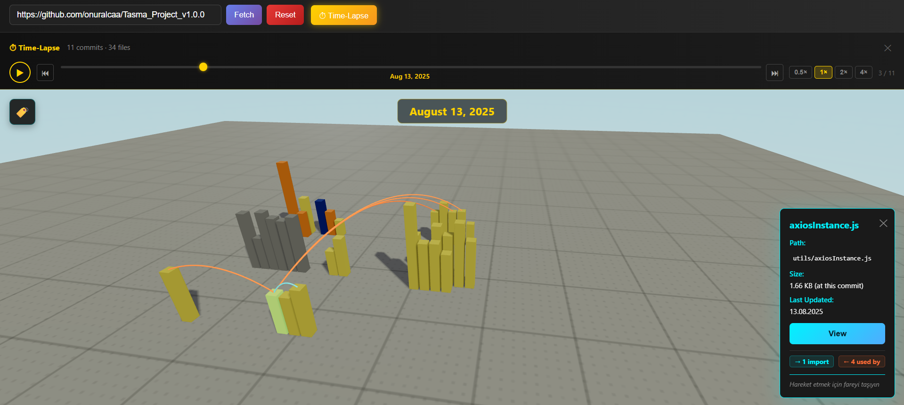
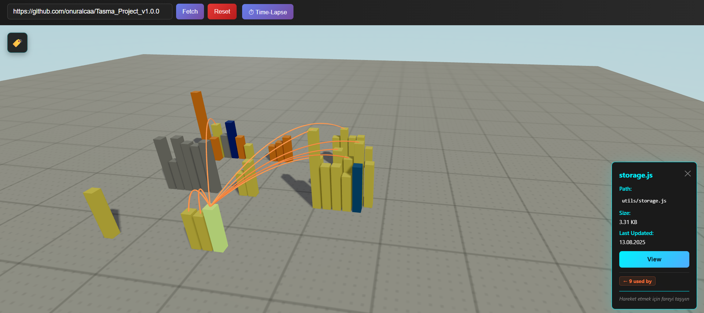

# GitVision 3D - Interactive 3D Code City Visualizer

Transform GitHub repositories into immersive 3D "Code Cities". Each file becomes a building — height represents file size, color represents file type. Navigate with intuitive 3D controls, click buildings for details, inspect file contents, replay the entire commit history as an animated time-lapse, and explore the project's dependency graph through glowing neon arcs.





## Features

### 3D City Visualization
- Every file is a building — height is a logarithmic scale of file size
- Color-coded by file type (JavaScript/TypeScript, Python, HTML, CSS, JSON, Rust, Go, and more)
- Files grouped by top-level directory into distinct city districts
- Realistic ground texture with grid lines and concrete detail
- Dynamic shadows that update as buildings grow and shrink

### Navigation & Interaction
- Orbit, pan, and zoom with mouse or touch gestures
- Camera is clamped above the ground — cannot go underground
- Hover over any building to highlight it with a green glow
- Click a building to open the file info panel (path, size, last commit date)
- "View" button opens a modal with the full raw file content
- Interactive file type legend (collapsible) in the top-left corner
- Mobile-friendly: pinch-to-zoom and drag navigation

### ⏱ Time-Lapse Mode
Replay the entire commit history of a repository as a live 3D animation.

- Click **⏱ Time-Lapse** in the topbar after loading a repo
- GitVision fetches up to 80 commits and builds a per-commit file snapshot
- Press **▶ Play** to watch the city grow from the first commit to the latest
- Buildings **animate smoothly** from height 0 as files are created, and grow/shrink as files change across commits
- Each commit transition waits for all buildings to finish animating before advancing — no jarring snaps
- Scrub the timeline manually with the slider, or jump to start/end with ⏮ / ⏭
- Speed control: **0.5×  1×  2×  4×**
- A large date overlay on the canvas shows the current commit date
- Shadows update in real time as buildings emerge

### 🔗 Dependency Arc Visualization
Visualize the architectural dependency graph of the codebase as glowing 3D arcs.

- After loading a repo, GitVision automatically parses source files in the background for `import`, `require`, `from`, `#include`, and similar statements
- Supported languages: JavaScript, TypeScript, Python, Ruby, Rust, Go, C/C++, PHP
- Click any building to see its dependency arcs rendered as **3D Bézier curves** arcing through the sky:
  - **Cyan arcs** → files this file imports (outgoing dependencies)
  - **Orange arcs** → files that import this file (incoming / used-by)
- Arcs pulse with a neon glow animation
- The info panel shows import/used-by counts as colored badges
- Arcs respect the Time-Lapse state — only files visible at the current commit are connected

## Tech Stack

| Layer | Technology |
|---|---|
| UI Framework | React 18.2+ |
| 3D Rendering | Three.js + React Three Fiber + Drei |
| GitHub API | Octokit (REST + GraphQL) |
| Build Tool | Vite 5.0+ |

## Requirements

- Node.js v16.0+
- npm v8.0+
- GitHub Personal Access Token (`public_repo` scope)

## Quick Start

### 1. Install Dependencies
```bash
npm install
```

### 2. Get a GitHub Token

1. Go to https://github.com/settings/tokens
2. Click **Generate new token (classic)**
3. Name: `GitVision 3D`
4. Scope: ✅ `public_repo`
5. Copy the generated token

### 3. Set Up Environment

Create a `.env` file in the project root:
```env
VITE_GITHUB_TOKEN=ghp_your_token_here
```

### 4. Start the Dev Server
```bash
npm run dev
```

Open http://localhost:5173/

## Usage

1. Paste a GitHub repo URL (e.g. `https://github.com/facebook/react`) into the input
2. Click **Fetch** — a progress bar tracks the data loading
3. The 3D city renders; hover buildings to highlight them, click to inspect
4. Click **View** in the info panel to read the raw file content
5. Click **⏱ Time-Lapse** to load commit history and animate the city's growth
6. Click any building while dependency data is ready to see its import arcs

## Project Structure

```
src/
├── components/
│   ├── City.jsx            # 3D city rendering, animation loop, raycasting
│   ├── DependencyArcs.jsx  # Glowing Bézier arc dependency visualization
│   ├── TimeLapse.jsx       # Timeline UI panel (scrubber, play/pause, speed)
│   ├── Controls.jsx        # OrbitControls with ground-clamp limits
│   ├── Ground.jsx          # Ground plane with deterministic concrete texture
│   ├── Sky.jsx             # Sky sphere background
│   └── Legend.jsx          # Collapsible file type legend
├── services/
│   └── github.js           # GitHub API: repo data, commit history, file content
├── utils/
│   ├── fileTypeColors.js   # File extension → color mapping
│   └── dependencyParser.js # Client-side import/require parser & resolver
├── App.jsx                 # Root component, state management
├── main.jsx                # Entry point
└── styles.css              # Global styles
```

## How It Works

| Property | Logic |
|---|---|
| **Color** | File extension → language category → fixed hex color |
| **Height** | `log(lines + 1) × 1.2`, minimum 0.8 units (logarithmic scale) |
| **Layout** | Top-level directories → districts on a grid; files within each district in rows of 6 |
| **Time-Lapse** | Per-commit recursive git tree fetched via REST; buildings lerp to new heights each frame |
| **Dependencies** | Regex parser extracts specifiers; relative paths resolved against the repo file list |
| **Arcs** | `THREE.QuadraticBezierCurve3` + `TubeGeometry`; control point lifted proportionally to distance |

## Troubleshooting

**"GitHub token required"** — Create a `.env` file with `VITE_GITHUB_TOKEN=...` and restart the dev server.

**"Failed to fetch repo"** — Check the URL format (`https://github.com/owner/repo`) and your internet connection.

**Black 3D scene** — WebGL must be enabled. Try Chrome or Firefox.

**Slow fetch / rate limit errors** — The app makes one API call per file for commit dates (up to 400 files). With a token the limit is 5 000 req/h; without one it's 60 req/h.

**Time-Lapse is slow to load** — Each commit requires two API calls (commit detail + tree). 80 commits = ~160 requests. This is normal; a progress bar tracks it.

**No dependency arcs appear** — The file may have no resolvable local imports, or the dependency fetch is still running (watch for the "Analysing dependencies…" hint in the info panel).

**Buildings go underground / camera clips** — The camera's polar angle is clamped to stay above the horizon. If you see this, reset the view by refreshing.

## Security

- Never commit your `.env` file — it is listed in `.gitignore`
- Use the minimum required token scope (`public_repo`)
- Tokens are only sent to the GitHub API; no third-party services receive them

## License

MIT License — see [LICENSE](./LICENSE) for details.

---

Built with React, Three.js, and the GitHub API.
