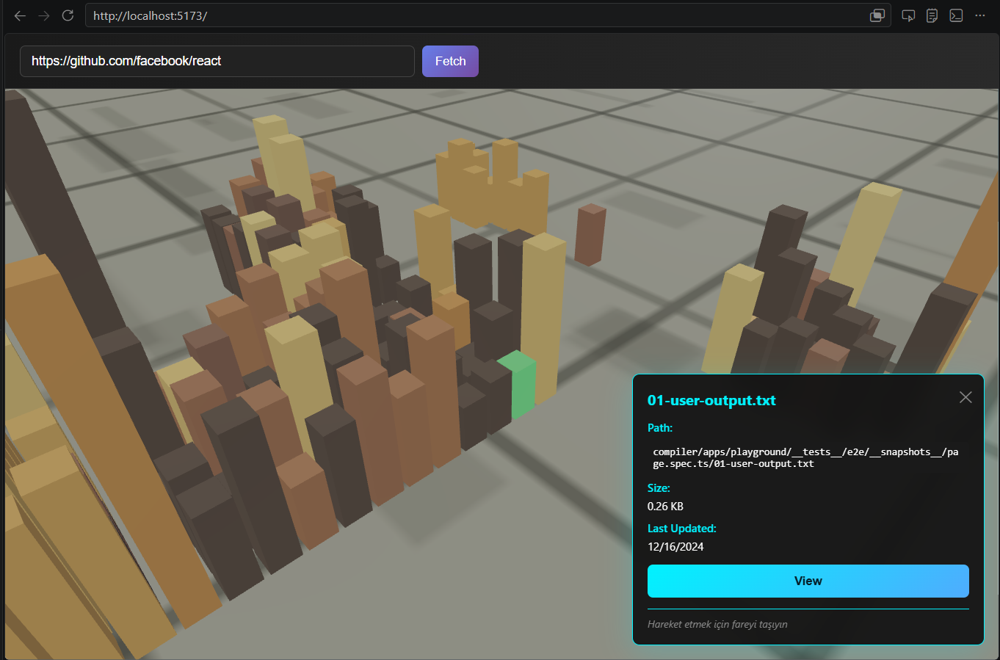
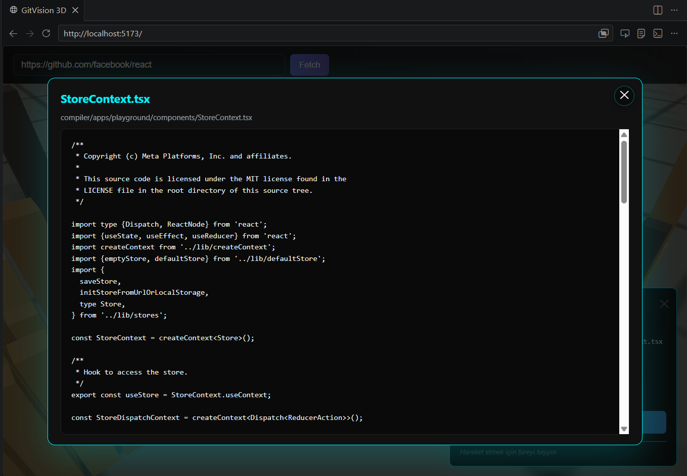

# GitVision 3D - Interactive 3D Code City Visualizer

Transform GitHub repositories into immersive 3D "Code Cities". Each file becomes a building—height represents file size, color represents modification date. Navigate with intuitive 3D controls, click buildings for details, and inspect file contents.





## Features

- 3D file visualization as interactive buildings
- Dynamic color coding (yellow for old files, orange-red for new)
- Smooth camera controls with mouse navigation
- File information panel with size and commit date
- Modal popup to view complete file contents
- Real-time GitHub repository fetching
- Progress tracking during data fetch
- Smart rate limit detection with token reminder
- Mobile-friendly touch controls (pinch-to-zoom, drag navigation)

## Tech Stack

- React 18.2+ - UI framework
- Three.js & React Three Fiber - 3D rendering
- Octokit - GitHub API client
- Vite 5.0+ - Build tool

## Requirements

- Node.js v16.0+
- npm v8.0+
- GitHub account (for personal access token)

## Quick Start

### 1. Install Dependencies
```bash
npm install
```

### 2. Get GitHub Token

1. Go to https://github.com/settings/tokens
2. Click "Generate new token (classic)"
3. Name: `GitVision 3D`
4. Scope: `public_repo`
5. Copy the token

### 3. Setup Environment

Create `.env` file in project root:
```env
VITE_GITHUB_TOKEN=ghp_your_token_here
```

### 4. Start Dev Server
```bash
npm run dev
```

Open http://localhost:5173/

## Usage

1. Paste GitHub repo URL (e.g., `https://github.com/facebook/react`)
2. Click "Fetch" - progress bar shows data loading
3. Click any building to view file details
4. Click "View" button to see file contents in modal
5. Drag mouse to rotate, scroll to zoom

## Project Structure

```
src/
├── components/
│   ├── City.jsx        # 3D city rendering and interaction
│   ├── Ground.jsx      # Ground plane with grid
│   ├── Sky.jsx         # Sky background
│   └── Controls.jsx    # Camera controls
├── services/
│   └── github.js       # GitHub API functions
├── App.jsx             # Main component
├── main.jsx            # Entry point
└── styles.css          # Global styles
```

## How It Works

- Color: Based on file age (newer = orange-red, older = yellow)
- Height: Logarithmic scale based on file size
- Layout: Files grouped by directory in grid layout

## Troubleshooting

**"GitHub token required"** - Check `.env` file exists with correct token. Restart dev server.

**"Failed to fetch repo"** - Verify URL format and internet connection.

**Black 3D scene** - Ensure WebGL is enabled. Try Chrome browser.

**Slow performance** - App limits to 400 files. Large repos may be slow.

## Security

- Never commit `.env` file to git
- Keep tokens secret
- Use minimal scopes on tokens

## License

MIT License - see LICENSE file for details

---

Built with React, Three.js, and GitHub API.
